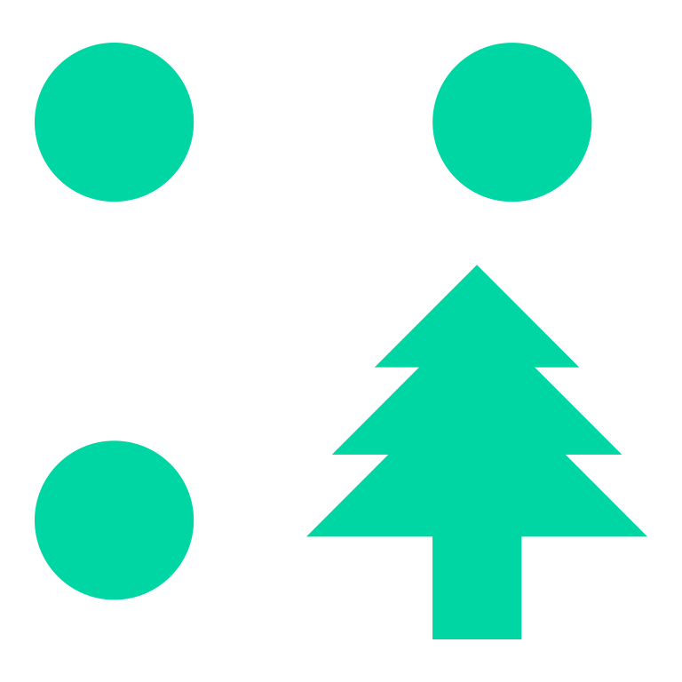
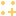

# Munji's collection of Blender & Godot addons
This is a collection of custom tools I use for my projects in Blender and Godot. A bit of documentation for each can be found below, but do note that I do not plan to actively maintain these tools, and will probably perform changes based on my projects' needs. Eitherways, feel free to use them for your own under MIT license.

### Contributing

Feel free to submit a Pull Request! I'll do my best to give it attention. I will review requests thoroughly given I use these tools constantly, so that they don't disrupt my own workflow.

##  Geometry Tool

### Features
- Export Blender geometry node transform data to .JSON.
- Custom  GeometryTool node to instance geometry node data in meshinstances.
- Basic control over visible instance count.

### Installation
- Download the python script `export_geonodes_to_json.py` and drag it onto your Blender scene, or open it via the Text Editor menu and press the run button. The export option `File > Export > Export GeoNodes to .JSON` should appear.
- Select your geometry node object and export it by selecting `Export GeoNodes to .JSON`. A pop-up will ask for the file name and save location.
- Export the instanced objects into Godot and save their  mesh individually during the import process. 
- If already exported, just save the  ArrayMesh by right clicking it, just make sure to name it the same way as the Blender object. Alternatively, save the meshes by specifying their save locations via the `Advanced` import settings of the exported file (gLTF, GLB, etc.)
- Now, copy the `/GeometryTool` folder to `res://addons` and reload the project.
  
### Usage
- Add the  GeometryTool node to the scene hierarchy via the add  menu, listed under  Node3D.
- Load the saved .JSON file in the `Json File` field. 
- By pressing  create geometry, the tool will recursively search for the saved mesh objects in the project files and set them as the  ArrayMesh for  MultiMeshInstance3D instances.
- Adjust the visible instance count, or leave it with a default value of -1 to draw all instances.
- Remove the geometry nodes.

### Stretch goals
- [ ] Selectively add or remove instance obejcts.
- [ ] Ability to control visible instance count per multimeshinstance.
- [ ] Automatic or custom collision shape instancing per multimeshinstance.
- [ ] Custom material override per multimesh instance mesh.
- [ ] Exclude geometry objects by name.

##  Blender Curve wrangler

(coming soon...)